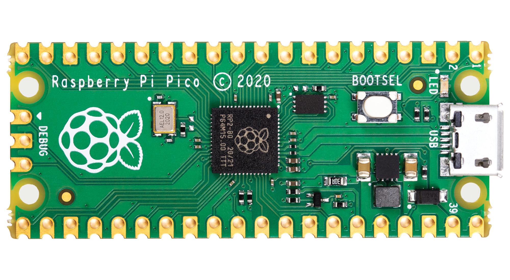

# Raspberry Pi Pico
A very small microcontroller, but then with small cost. It's price 5$!
You can buy anywhere.

# Buying (Kits)
I'am buyed a Raspberry Pi Pico and Raspberry Pi Starter Kit-01 from Serbia. That kit has recommended for RPi 1B,2B,3B (support 4 and 4B, but has not listed:)).
Price of the kit is (in RSD: 5.364.00 RSD, in EUR: 51 EUR;) in $ 53 USD.
Raspberry Pi Pico is (in RSD: 1.114.00 RSD, in eur: 11 EUR;) in $ 10-11 USD, but with soldered headers.
It i'am finded kit in MikroPrinc (MicroPrinc) and Pico in malina314 (raspberry314).
Link to kit: [here](https://www.mikroprinc.com/sr/proizvod/raspberry-pi-starter-kit-01).
Link to Raspberry Pi Pico: [here](https://www.malina314.com/proizvod/raspberry-pi-pico/).
All links are from Serbia.
Kit image (all parts):

# How to run Pico (or program on that)?
I'am here, in this using MicroPython (but you are can use and CircuitPython from Adafruit).
When you unbox Pico, go to MicroPython some website or link [this here](https://micropython.org/download/rp2-pico/) and download a last version.
In Pico, programing is drag n' drop. Hold a BOOTSEL button and insert a MicroUSB cable in Pico. After that unpush the BOOTSEL buuton. Copy a .uf2 file
that you downloaded from MicroPython website to your Pico, Pico will be automatically restarted and goes to MicroPython. Congularations! You're seted up now a your Pico.
# If nedded something program or that to use to can start a code?
No. But still is reccomended [Thonny](https://thonny.org) beacuse can Start/Stop/Reset Pico or code and detect many errors. It's interactive playground for programerrs.
# How to my Pico automaticaly run a my program when i turn on it with cable (not selecting a BOOTSEL button and run program with Thonny)?
It's still easy too! Just copy you program (in python file) on your Pico (after selecting a BOOTSELECT button) and name it (it's important), just name it as main.py .
# How to run my programs from GitHb?
In previously charapter, i'am sayed to copy a program and name it main.py . From my code, download this file and copy to pico. Last step (important): name it main.py .
# Raspberry Pi Pico GPIO (Output - Pinout):

